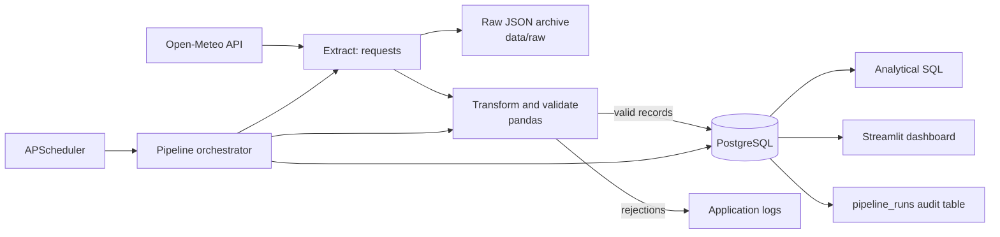

# Kenyan Weather ETL Pipeline

## Project overview

This portfolio project will collect model-derived current weather conditions for
Kakamega, Kisumu, Nairobi, and Mombasa; archive each original API response;
validate and transform the data; store it in PostgreSQL; and present analysis in
a Streamlit dashboard.

## Architecture



## Data source

The project will use the [Open-Meteo Weather Forecast API](https://open-meteo.com/en/docs).
It returns model-derived current weather conditions for supplied coordinates.
The planned fields are timestamp, temperature, relative humidity, wind speed,
mean sea-level pressure, weather code, latitude, and longitude.

## Design decisions

- Each city is requested by coordinate, avoiding ambiguous city-name lookups.
- Original API payloads are retained before transformation for traceability.
- PostgreSQL will enforce a unique `(location_id, observed_at, source)` key to
  prevent duplicate scheduled observations.
- Invalid records will be rejected explicitly and counted in pipeline logs.
- Runtime configuration is supplied through `.env`; secrets are excluded from Git.

## Planned database model

| Table | Purpose |
| --- | --- |
| `locations` | Kenyan city metadata and coordinates |
| `weather_observations` | Validated weather records keyed by location and timestamp |
| `pipeline_runs` | Audit history, status, counts, and failures |

## Development status

Phase 2 implements extraction with bounded HTTP retries, request timeouts,
per-city logging, and raw JSON archival. Transformation, loading, scheduling,
analytics, dashboard functionality, Docker services, and full tests will be
introduced in their respective later phases.

## Run Phase 2 extraction

Create a local `.env` from `.env.example`, activate the virtual environment, and
run the extraction module:

```powershell
Copy-Item .env.example .env
.\.venv\Scripts\Activate.ps1
python -m src.extract
```

Each successful city request creates an ignored file named like
`data/raw/weather_nairobi_2026-09-18T120000Z.json`. Test without contacting the
API with:

```powershell
pytest tests/test_extract.py -q
```

If your organization intercepts HTTPS traffic, configure its trusted CA bundle
in the operating-system certificate store or set `REQUESTS_CA_BUNDLE` to the
approved CA file. Do not disable TLS verification.

## Phase 3 data-quality rules

The transformation layer converts raw API payloads into a predictable pandas
schema. It trims text, normalizes supported field-name variants, coerces data
types, converts local API timestamps to UTC, removes duplicate observations,
and returns rejected records with explicit reasons.

Required fields are location, coordinates, timestamp, temperature, humidity,
and wind speed. Latitude must be -90 to 90, longitude -180 to 180, temperature
-90 to 60 °C, humidity 0 to 100%, and wind speed cannot be negative. Pressure
is optional but, when supplied, must be 300 to 1200 hPa.

## Phase 4 PostgreSQL schema

The database design separates reusable location metadata from time-series
observations and pipeline audit data:

| Table | Purpose | Key integrity controls |
| --- | --- | --- |
| `locations` | City, country, and geographic coordinates | Unique city/country and valid coordinate ranges |
| `weather_observations` | Clean weather measurements at a point in time | Foreign keys, measurement checks, and unique location/time/source observations |
| `pipeline_runs` | Execution status, counts, timestamps, and errors | Valid statuses, non-negative counts, and completion rules |

`weather_observations` has a unique `(location_id, observed_at, source)` key.
That database-level rule is the final safeguard against duplicate scheduled
observations, even if an application process retries a run.

To create the schema after PostgreSQL is available:

```powershell
psql -h localhost -U weather_user -d weather_etl -f sql/schema.sql
```

The next phase will connect with SQLAlchemy and execute this schema through the
application workflow; this phase intentionally defines only the database model.

## Phase 5 loading behaviour

`src/load.py` uses SQLAlchemy with the PostgreSQL connection values in `.env`.
It creates a `pipeline_runs` audit row, upserts locations, and inserts only
validated observations in one transaction. If any database operation fails,
SQLAlchemy rolls back the transaction. PostgreSQL's unique observation key and
`ON CONFLICT DO NOTHING` make repeated loads idempotent; duplicates are counted
and logged rather than inserted.

## Phase 6 pipeline orchestration

Run the full pipeline once with:

```powershell
python -m src.pipeline
```

The orchestrator creates a `pipeline_runs` audit entry, executes extraction,
transformation, and loading in order, and records final counts and status. If a
stage fails, its name and error are logged and the audit row is marked failed;
the original exception is then raised to make operational failures visible.

## Phase 7 scheduling

Run the hourly scheduler with:

```powershell
python -m src.scheduler
```

`SCHEDULE_MINUTES` in `.env` controls the interval and defaults to `60`.
APScheduler permits only one in-process run at a time, coalesces missed runs,
and gives a delayed run a five-minute grace period. The database unique key is
still the final duplicate-prevention layer. For one manual development run, use
`python -m src.pipeline` instead.

## Phase 8 analytical SQL

[sql/analytics.sql](sql/analytics.sql) contains ten PostgreSQL queries for
daily temperature statistics, location comparisons, humidity, weather-condition
distribution, daily ranges, latest records, missing observations, and pipeline
success/failure metrics. Day-based queries use the `Africa/Nairobi` time zone
while the database continues storing timestamps in UTC.

After applying the schema and loading data, execute the file with:

```powershell
psql -h localhost -U weather_user -d weather_etl -f sql/analytics.sql
```

## Phase 9 dashboard

The Streamlit dashboard queries PostgreSQL directly and provides location/date
filters, weather KPIs, pipeline health, and temperature, humidity,
weather-condition, and daily-range charts. It does not read `data/raw/`.

Start it after PostgreSQL contains observations:

```powershell
streamlit run dashboard/app.py
```
