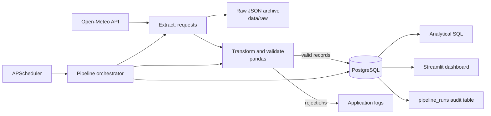

# Kenyan Weather ETL Pipeline

## Project overview

This portfolio project will collect model-derived current weather conditions for
Kakamega, Kisumu, Nairobi, and Mombasa; archive each original API response;
validate and transform the data; store it in PostgreSQL; and present analysis in
a Streamlit dashboard.

## Architecture

## Data source

The project will use the [Open-Meteo Weather Forecast API](https://open-meteo.com/en/docs).
It returns model-derived current weather conditions for supplied coordinates.
The planned fields are timestamp, temperature, relative humidity, wind speed,
mean sea-level pressure, weather code, latitude, and longitude.

## Design decisions

- Each city is requested by coordinate, avoiding ambiguous city-name lookups.
- Original API payloads are retained before transformation for traceability.
- PostgreSQL will enforce a unique `(location_id, observed_at, source)` key to
  prevent duplicate scheduled observations.
- Invalid records will be rejected explicitly and counted in pipeline logs.
- Runtime configuration is supplied through `.env`; secrets are excluded from Git.

## Planned database model

| Table | Purpose |
| --- | --- |
| `locations` | Kenyan city metadata and coordinates |
| `weather_observations` | Validated weather records keyed by location and timestamp |
| `pipeline_runs` | Audit history, status, counts, and failures |

## Development status

Phase 1 is project setup. Extraction, transformation, loading, scheduling,
analytics, dashboard functionality, Docker services, and full tests will be
introduced in their respective later phases.
